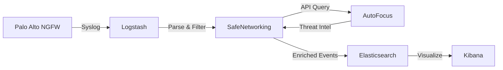

# Introduction to SafeNetworking

SafeNetworking is a threat intelligence platform that receives both THREAT and TRAFFIC syslog events from Palo Alto Networks Next-Generation Firewalls (NGFWs). Using the Palo Alto Networks Threat Intelligence Cloud, SafeNetworking correlates threat logs—primarily DNS queries—with known malware associated with those events.

SafeNetworking utilizes ElasticStack's open-source version to gather, store, and visualize these enriched security events, providing service providers and network security teams with actionable threat intelligence.

## What SafeNetworking Does

SafeNetworking acts as a bridge between your Palo Alto Networks firewalls and the AutoFocus threat intelligence platform. When DNS queries or other security events occur on your network, SafeNetworking:

1. **Receives** syslog events from NGFWs running PAN-OS 8.x and 9.x
2. **Enriches** DNS threat logs with malware intelligence from AutoFocus
3. **Correlates** events with known command-and-control (C&C) channels
4. **Visualizes** threat data through Kibana dashboards
5. **Stores** enriched events in Elasticsearch for historical analysis

## Key Features

<CardGroup cols={2}>
  <Card title="DNS Threat Enrichment" icon="magnifying-glass-chart">
    Automatically enriches DNS queries with malware intelligence from AutoFocus, including domain reputation, malware families, and threat indicators.
  </Card>
  
  <Card title="IoT Threat Detection" icon="shield-halved">
    Full support for non-PAN-OS IoT known threat events parsed through Logstash and tagged in Elasticsearch via HoneyPot database information.
  </Card>
  
  <Card title="GTP/SCTP Support" icon="tower-cell">
    Complete support for GTP and SCTP logs with EventCode enrichment, essential for service provider and mobile network environments.
  </Card>
  
  <Card title="ElasticStack Integration" icon="database">
    Leverages Elasticsearch 7.x, Logstash, and Kibana for powerful log aggregation, processing, and visualization capabilities.
  </Card>
</CardGroup>

### Additional Capabilities

- **EDL (External Dynamic List) Support**: Process and tag DNS events derived from EDL-based threat feeds
- **Cloud-DNS Logging**: Separate categorization for DGA (Domain Generation Algorithm) and DNS tunneling events
- **Dated Indexes**: Automatic index rotation using `threat-<year.month>` pattern to reduce shard errors
- **Tag Groups**: Enhanced searchability with automatic tag group associations for events
- **Multiple Workspaces**: Separate Kibana visualizations for DNS Threat, IoT Threat, GTP/SCTP, and System Logging

## Use Cases

### Service Providers

SafeNetworking was initially designed for the service provider market, enabling providers to:

- Monitor customer networks for malware and malicious behavior
- Identify compromised devices using C&C channels
- Provide value-added security services to subscribers
- Track GTP/SCTP events in mobile network environments
- Detect and report on IoT threats across customer bases

### Network Security Teams

Enterprise security teams can use SafeNetworking to:

- Gain deeper visibility into DNS-based threats
- Correlate firewall events with global threat intelligence
- Investigate malware infections and lateral movement
- Track threat actor campaigns targeting the organization
- Maintain historical threat data for compliance and forensics

## How It Works

<Steps>
  <Step title="Firewall sends syslogs">
    Your Palo Alto Networks NGFW sends THREAT and TRAFFIC logs via syslog to the SafeNetworking system.
  </Step>
  
  <Step title="Logstash processes events">
    Logstash receives the syslog data on UDP port 5514 and parses the events into structured documents.
  </Step>
  
  <Step title="SafeNetworking enriches data">
    The SafeNetworking Python application queries AutoFocus API to enrich DNS events with malware intelligence.
  </Step>
  
  <Step title="Data stored and visualized">
    Enriched events are stored in Elasticsearch and visualized through Kibana dashboards.
  </Step>
</Steps>

## Architecture Components

SafeNetworking consists of several integrated components:

- **Python Application**: Core processing engine that handles AutoFocus API queries and event enrichment
- **Elasticsearch**: NoSQL database that stores threat events and enriched domain information
- **Logstash**: Log processing pipeline with separate pipelines for DNS, IoT, GTP/SCTP, and system logs
- **Kibana**: Visualization platform with pre-built dashboards for threat analysis
- **Flask**: Web framework providing internal APIs and management interfaces

## Data Flow

SafeNetworking processes events through several stages:

1. **Ingestion**: Logstash receives syslog events and categorizes them (DNS, IoT, GTP/SCTP)
2. **Classification**: Events are tagged and classified based on type and characteristics
3. **Enrichment**: DNS events are queried against AutoFocus for malware intelligence
4. **Caching**: Domain and tag information is cached to optimize AutoFocus API usage
5. **Storage**: Enriched events are indexed in Elasticsearch with dated indexes
6. **Visualization**: Kibana dashboards display threat trends, malware families, and event details

## Version Information

Current version: **v4.0** (Released June 15, 2019)

<Note>
SafeNetworking requires ElasticStack 7.x and runs on Ubuntu 18.04 LTS or compatible Linux distributions.
</Note>

## Support Policy

<Warning>
SafeNetworking is released under an as-is, best effort support policy. The code is community-supported, and Palo Alto Networks contributes expertise when possible. This is not covered by standard Palo Alto Networks support channels.
</Warning>

The underlying VM-Series firewall products used with SafeNetworking are fully supported, but support is limited to product functionality rather than the SafeNetworking application itself.

## Next Steps

<CardGroup cols={2}>
  <Card title="Quick Start" icon="rocket" href="/quickstart">
    Get SafeNetworking up and running in minutes with our quick start guide.
  </Card>
  
  <Card title="Installation" icon="download" href="/installation">
    Detailed installation instructions for production deployments.
  </Card>
</CardGroup>
