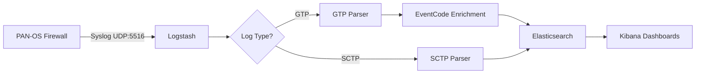

## Overview

SafeNetworking provides specialized logging and enrichment for service provider protocols GPRS Tunneling Protocol (GTP) and Stream Control Transmission Protocol (SCTP). These features enable mobile network operators to monitor subscriber traffic, detect anomalies, and troubleshoot network issues.

<Note>
GTP/SCTP support was introduced in **SafeNetworking 3.5** and enhanced in **Version 4.0** with full EventCode enrichment.
</Note>

## What are GTP and SCTP?

<CardGroup cols={2}>
  <Card title="GTP (GPRS Tunneling Protocol)" icon="tower-cell">
    Protocol used in mobile networks (3G/4G/5G) to encapsulate and route subscriber data between network nodes. Carries user traffic, signaling, and billing information.
  </Card>
  <Card title="SCTP (Stream Control Transmission Protocol)" icon="network-wired">
    Transport protocol used in telecommunications for reliable, message-oriented communication. Common in SS7 signaling networks and diameter authentication.
  </Card>
</CardGroup>

### Why Monitor These Protocols?

Service providers need visibility into GTP/SCTP traffic for:

- **Subscriber tracking** - Monitor IMSI, IMEI, MSISDN across network sessions
- **Roaming analysis** - Track international roaming patterns and costs
- **Fraud detection** - Identify SIM box fraud, roaming fraud, and subscription fraud
- **Network troubleshooting** - Debug session establishment failures and handoff issues
- **Capacity planning** - Analyze data usage patterns by APN, cell site, and device type
- **Regulatory compliance** - Retain lawful intercept records and subscriber metadata

## Service Provider Use Cases

<AccordionGroup>
  <Accordion title="Mobile Virtual Network Operator (MVNO)">
    **Scenario**: MVNO needs to monitor subscriber data usage across host network infrastructure
    
    **Requirements**:
    - Track GTP sessions by IMSI to correlate with billing system
    - Monitor APN usage to enforce data plan limits
    - Detect roaming events for cost allocation
    - Identify high-volume users for QoS policies
    
    **SafeNetworking Solution**: GTP logs enriched with EventCode details provide complete session visibility including create/update/delete events, data volumes, and roaming status.
  </Accordion>
  
  <Accordion title="Tier 1 Mobile Carrier">
    **Scenario**: National carrier operating LTE network needs to detect SS7 signaling attacks
    
    **Requirements**:
    - Monitor SCTP associations for abnormal patterns
    - Detect SMS interception attempts via MAP spoofing
    - Track diameter authentication failures
    - Alert on suspicious IMSI lookups
    
    **SafeNetworking Solution**: SCTP logs with chunk type and event code enrichment enable detection of signaling anomalies and potential attacks on core network.
  </Accordion>
  
  <Accordion title="Managed Security Service Provider (MSSP)">
    **Scenario**: MSSP providing security monitoring for multiple telecom customers
    
    **Requirements**:
    - Centralized logging from multiple carrier networks
    - Correlation of GTP events with threat intelligence
    - Detection of SIM box fraud and IRSF (International Revenue Share Fraud)
    - Compliance reporting for lawful intercept
    
    **SafeNetworking Solution**: Multi-tenant architecture with indexed GTP/SCTP logs enables per-customer dashboards, alerting, and compliance reporting.
  </Accordion>
</AccordionGroup>

## Architecture

### Logstash Pipeline

PAN-OS firewalls send GTP and SCTP logs via syslog to Logstash, which parses and enriches them before indexing in Elasticsearch:



### Input Configuration

Logstash listens for GTP/SCTP logs on UDP port 5516:

```ruby
# From gtp.conf:1-8
input {
    # Input for PAN-OS device GTP logs
    udp {
        host => "0.0.0.0"
        port => "5516"
        tags => [ "PAN-OS_gtp" ]
    }
}
```

<Warning>
**Firewall Configuration Required**: Configure your PAN-OS firewall to send GTP/SCTP logs to SafeNetworking server on UDP port 5516.
</Warning>

## Log Parsing

### SCTP Log Format

SCTP logs contain 56 fields including association details, chunk information, and SCCP parameters:

```ruby
# From gtp.conf:13-37
if ([message] =~ /SCTP/) {
    csv {
        source => "message"
        columns => [ 
            "Domain", "ReceiveTime", "SerialNumber", "Type", "Threat_ContentType",
            "Config Version", "GeneratedTime", "SourceIP", "DestinationIP",
            "NATSourceIP", "NATDestinationIP", "RuleName", "SourceUser",
            "DestinationUser", "Application", "VirtualSystem", "SourceZone",
            "DestinationZone", "InboundInterface", "OutboundInterface",
            "LogForwardingProfile", "TimeLogged", "SessionID", "RepeatCount",
            "SourcePort", "DestinationPort", "NATSourcePort", "NATDestinationPort",
            "Flags", "Protocol", "Action", "DeviceGroupHierarchyLevel1",
            "DeviceGroupHierarchyLevel2", "DeviceGroupHierarchyLevel3",
            "DeviceGroupHierarchyLevel4", "VirtualSystemName", "DeviceName",
            "SequenceNumber", "Action_Flags", "SCTP_Association_ID",
            "Payload_Protocol_ID", "Severity", "SCTP_Chunk_Type", "SCTP_Event_Type",
            "SCTP_Event_Code", "SCTPVerificationTag1", "SCTPVerificationTag2",
            "SCTP_Cause_Code", "Diameter_App_ID", "Diameter_Command_Code",
            "Diameter_AVP_Code", "SCTP_Stream_ID", "SCTP_Assocation_End_Reason",
            "op_code", "SCCPCallingPartySSN", "SCCPCallingPartyGlobalTitle",
            "SCTP_Filter_ID", "SCTP_Chunks", "SCTP_Chunks_Sent",
            "SCTP_Chunks_Received", "Packets", "PacketsSent", "PacketsReceived"
        ]
    }
    mutate {
        add_tag => ["SFN-SCTP"]
    }
}
```

### GTP Log Format

GTP logs contain 68 fields including subscriber identifiers (IMSI, MSISDN), location data (MCC, MNC, Cell ID), and session metrics:

```ruby
# From gtp.conf:40-67
else if ([message] =~ /GTP/) {
    csv {
        source => "message"
        columns => [ 
            "Domain", "ReceiveTime", "SerialNumber", "Type", "Threat_ContentType",
            "Config Version", "GeneratedTime", "SourceIP", "DestinationIP",
            "NATSourceIP", "NATDestinationIP", "RuleName", "SourceUser",
            "DestinationUser", "Application", "VirtualSystem", "SourceZone",
            "DestinationZone", "InboundInterface", "OutboundInterface",
            "LogForwardingProfile", "TimeLogged", "SessionID", "RepeatCount",
            "SourcePort", "DestinationPort", "NATSourcePort", "NATDestinationPort",
            "Flags", "Protocol", "Action", "EventType", "MSISDN", "APN", "RAT",
            "MsgType", "EndIPAddr", "TEID1", "TEID2", "GTPInterface", "CauseCode",
            "Severity", "MCC", "MNC", "AreaCode", "CellID", "EventCode",
            "SequenceNumber", "ActionFlags", "SourceLocation", "DestinationLocation",
            "cpadding", "DeviceGroupHierarchyLevel1", "DeviceGroupHierarchyLevel2",
            "DeviceGroupHierarchyLevel3", "DeviceGroupHierarchyLevel4",
            "VirtualSystemName", "DeviceName", "TunnelID_IMSI", "MonitorTag_IMEI",
            "ParentSessionID", "ParentStartTime", "TunnelType", "Bytes",
            "BytesSent", "BytesReceived", "Packets", "PacketsSent",
            "PacketsReceived", "MaxEncap", "UnknownProto", "StrictCheck",
            "TunnelFrag", "SessionsCreated", "SessionsClosed", "SessionEndReason",
            "ActionSource", "StartTime", "ElapsedTime"
        ]
    }
    mutate {
        add_tag => ["SFN-GTP"]
    }
}
```

## EventCode Enrichment

GTP EventCodes provide detailed information about message types and protocol events. SafeNetworking enriches logs by looking up EventCode descriptions from a reference index.

### Enrichment Process

```ruby
# From gtp.conf:69-91
if ([EventCode] =~ "^144*$" and [EventCode] !~ "^1441*$" and [EventCode] !~ "^1442*$"){
    # Invalid GTP version
    mutate {
        add_field => {"[GTP][GTPVersion]" => "Invalid"}
        add_field => {"[GTP][Description]" => "Invalid GTP Version"}
        add_field => {"[GTP][InformationElement]" => ""}
        add_field => {"[GTP][MessageType]" => ""}
        add_field => {"[GTP][EventCode]" => "%{[EventCode]}"}
    }
}
else {
    # Lookup EventCode details from reference index
    elasticsearch {
        hosts => ["elasticsearch"]
        index => ["test-gtp-codes"]
        enable_sort => "false"
        query => "EventCode:%{[EventCode]}"
        fields => { "GTPVersion" => "[GTP][GTPVersion]" }
        fields => { "Description" => "[GTP][Description]" }
        fields => { "InformationElement" => "[GTP][InformationElement]" }
        fields => { "MessageType" => "[GTP][MessageType]" }
        fields => { "EventCode" => "[GTP][EventCode]"}
    }
}
```

### EventCode Reference Index

The `test-gtp-codes` index contains EventCode mappings:

```json
{
  "EventCode": "14410",
  "GTPVersion": "GTPv1",
  "MessageType": "Create PDP Context Request",
  "InformationElement": "IMSI",
  "Description": "Request to create a new PDP context (data session)"
}
```

<Tip>
Populate the EventCode reference index using the GTP specification from 3GPP TS 29.060. SafeNetworking includes a sample dataset for common EventCodes.
</Tip>

### Common GTP EventCodes

| EventCode | Version | Message Type | Description |
|-----------|---------|--------------|-------------|
| 14410 | GTPv1 | Create PDP Context Request | Initiate new data session |
| 14411 | GTPv1 | Create PDP Context Response | Acknowledge session creation |
| 14412 | GTPv1 | Update PDP Context Request | Modify existing session parameters |
| 14413 | GTPv1 | Update PDP Context Response | Confirm session update |
| 14414 | GTPv1 | Delete PDP Context Request | Terminate data session |
| 14415 | GTPv1 | Delete PDP Context Response | Acknowledge session termination |
| 14416 | GTPv2 | Create Session Request | GTPv2 equivalent of PDP context creation |
| 14417 | GTPv2 | Create Session Response | GTPv2 session creation response |
| 14418 | GTPv2 | Delete Session Request | GTPv2 session termination |

## Geographic Enrichment

Logstash adds geographic location data for non-RFC1918 IP addresses:

```ruby
# From gtp.conf:105-130
# Geolocate source IPs
if [SourceIP] and [SourceIP] !~ "(^127\.0\.0\.1)|(^10\.)|(^172\.1[6-9]\.)|(^172\.2[0-9]\.)|(^172\.3[0-1]\.)|(^192\.168\.)|(^169\.254\.)" {
    geoip {
        source => "SourceIP"
        target => "SourceIPGeo"
    }
    
    # Remove invalid 0,0 coordinates
    if ([SourceIPGeo.location] and [SourceIPGeo.location] =~ "0,0") {
        mutate {
            replace => [ "SourceIPGeo.location", "" ]
        }
    }
}

# Geolocate destination IPs
if [DestinationIP] and [DestinationIP] !~ "(^127\.0\.0\.1)|(^10\.)|(^172\.1[6-9]\.)|(^172\.2[0-9]\.)|(^172\.3[0-1]\.)|(^192\.168\.)|(^169\.254\.)" {
    geoip {
        source => "DestinationIP"
        target => "DestinationIPGeo"
    }
    
    if ([DestinationIPGeo.location] and [DestinationIPGeo.location] =~ "0,0") {
        mutate {
            replace => [ "DestinationIPGeo.location", "" ]
        }
    }
}
```

## Flow Fingerprinting

Each GTP/SCTP session is fingerprinted using a SHA1 hash of the 5-tuple:

```ruby
# From gtp.conf:133-140
if [SourceIP] and [DestinationIP] {
    fingerprint {
        concatenate_sources => true
        method => "SHA1"
        key => "logstash"
        source => [ "SourceIP", "SourcePort", "DestinationIP", "DestinationPort", "Protocol" ]
    }
}
```

This enables:
- Deduplication of repeated log entries
- Efficient "top N flows" queries in Kibana
- Session correlation across log entries

## Output Configuration

Logs are indexed separately by protocol type:

```ruby
# From gtp.conf:144-163
output {
    if "SFN-GTP" in [tags] {
        elasticsearch {
            hosts    => [ 'elasticsearch' ]
            index => "gtp-%{+YYYY.MM}"
        }
    }
    else if "SFN-SCTP" in [tags] {
        elasticsearch {
            hosts    => [ 'elasticsearch' ]
            index => "sctp-%{+YYYY.MM}"
        }
    }
    else {
        # Unparseable logs go to file
        file {
            path => "/var/log/logstash/failed_gtp_events-%[+YYYY.MM].log"
        }
    }
}
```

### Index Patterns

<CardGroup cols={2}>
  <Card title="GTP Logs" icon="database">
    **Index Pattern**: `gtp-YYYY.MM`
    
    Example: `gtp-2026.03`
    
    Monthly indices for subscriber session logs
  </Card>
  <Card title="SCTP Logs" icon="database">
    **Index Pattern**: `sctp-YYYY.MM`
    
    Example: `sctp-2026.03`
    
    Monthly indices for signaling protocol logs
  </Card>
</CardGroup>

## Firewall Configuration

Configure your PAN-OS firewall to send GTP/SCTP logs to SafeNetworking:

<Steps>
  <Step title="Create Syslog Server Profile">
    Navigate to **Device > Server Profiles > Syslog**
    
    - Name: `SafeNetworking-GTP`
    - Server: `<SafeNetworking-IP>`
    - Protocol: UDP
    - Port: 5516
    - Format: BSD
  </Step>
  
  <Step title="Create Log Forwarding Profile">
    Navigate to **Objects > Log Forwarding**
    
    - Name: `Forward-GTP-SCTP`
    - Log Type: GTP
    - Syslog Profile: `SafeNetworking-GTP`
    
    Repeat for SCTP log type
  </Step>
  
  <Step title="Apply to GTP Security Policy">
    Navigate to **Policies > Security**
    
    Edit your GTP/SCTP policy rules:
    - Actions > Log Forwarding: `Forward-GTP-SCTP`
    - Log at Session Start: Yes
    - Log at Session End: Yes
  </Step>
  
  <Step title="Commit Configuration">
    Click **Commit** to activate GTP/SCTP logging
  </Step>
</Steps>

<Warning>
**Performance Impact**: Logging at session start and end for high-volume GTP traffic can generate significant log volume. Start with a subset of policies and monitor firewall dataplane CPU utilization.
</Warning>

## Index Mapping Considerations

### TunnelID_IMSI Field Type

IMSI (International Mobile Subscriber Identity) values are stored in `TunnelID_IMSI` field:

```json
{
  "mappings": {
    "properties": {
      "TunnelID_IMSI": {
        "type": "keyword"
      }
    }
  }
}
```

<Note>
In SafeNetworking 3.5, `TunnelID_IMSI` was incorrectly mapped as `long`, causing indexing failures for IMSI values with leading zeros. **Version 4.0** corrects this to `text/keyword` mapping.
</Note>

## Kibana Dashboards

SafeNetworking 4.0 includes dedicated workspaces for GTP/SCTP analysis:

### GTP Dashboard Components

<AccordionGroup>
  <Accordion title="Subscriber Activity">
    - Active sessions by IMSI/MSISDN
    - Session creation/deletion rate timeline
    - Top APNs by data volume
    - Device type distribution (IMEI analysis)
  </Accordion>
  
  <Accordion title="Roaming Analysis">
    - International roaming sessions by MCC/MNC
    - Roaming partner traffic volumes
    - Geographic heat map of roaming locations
    - Cost allocation by roaming destination
  </Accordion>
  
  <Accordion title="Network Topology">
    - GTP tunnel endpoints (SGSN, GGSN, PGW, SGW)
    - TEID allocation and reuse patterns
    - Interface type distribution (S1-U, S5/S8, S11)
    - Network element availability
  </Accordion>
  
  <Accordion title="Traffic Patterns">
    - Data volume by APN and RAT (Radio Access Technology)
    - Peak usage hours and bandwidth consumption
    - Session duration distribution
    - Protocol violations and error rates
  </Accordion>
</AccordionGroup>

### SCTP Dashboard Components

<AccordionGroup>
  <Accordion title="Association Management">
    - Active SCTP associations
    - Association establishment/teardown rate
    - Verification tag validation failures
    - Association endpoint distribution
  </Accordion>
  
  <Accordion title="Chunk Analysis">
    - Chunk type distribution (DATA, SACK, INIT, etc.)
    - Retransmission rates
    - Congestion window behavior
    - Out-of-order delivery events
  </Accordion>
  
  <Accordion title="Diameter Signaling">
    - Command code frequency (e.g., CER, CEA, DWR, DWA)
    - Application ID distribution (e.g., Gx, Gy, S6a)
    - AVP analysis for authentication
    - Result code trending (success/failure)
  </Accordion>
  
  <Accordion title="SS7/SCCP Events">
    - Calling/Called party SSN distribution
    - Global Title translations
    - SCCP opcodes and message types
    - MAP operation success rates
  </Accordion>
</AccordionGroup>

## Query Examples

### Find All Sessions for Specific IMSI

```json
GET gtp-*/_search
{
  "query": {
    "term": {
      "TunnelID_IMSI": "310150123456789"
    }
  },
  "sort": [
    { "GeneratedTime": "desc" }
  ]
}
```

### Top 10 APNs by Data Volume

```json
GET gtp-*/_search
{
  "size": 0,
  "aggs": {
    "top_apns": {
      "terms": {
        "field": "APN",
        "size": 10,
        "order": { "total_bytes": "desc" }
      },
      "aggs": {
        "total_bytes": {
          "sum": { "field": "Bytes" }
        }
      }
    }
  }
}
```

### Detect Roaming Fraud Pattern

```json
GET gtp-*/_search
{
  "query": {
    "bool": {
      "must": [
        { "exists": { "field": "TunnelID_IMSI" }},
        { "range": { "Bytes": { "gte": 1000000000 }}},
        { "range": { "ElapsedTime": { "lte": 300 }}}
      ],
      "must_not": [
        { "prefix": { "MCC": "310" }}
      ]
    }
  }
}
```

This query finds sessions with:
- Valid IMSI
- Over 1GB data transfer
- Duration under 5 minutes
- Foreign MCC (not US 310)

Potential indicator of IRSF or data fraud.

### SCTP Association Failures

```json
GET sctp-*/_search
{
  "query": {
    "bool": {
      "must": [
        { "term": { "SCTP_Event_Type": "association" }},
        { "term": { "Action": "deny" }}
      ]
    }
  },
  "aggs": {
    "failure_reasons": {
      "terms": {
        "field": "SCTP_Assocation_End_Reason",
        "size": 20
      }
    }
  }
}
```

## Troubleshooting

<AccordionGroup>
  <Accordion title="No GTP/SCTP logs appearing">
    **Check firewall configuration:**
    
    ```bash
    # From firewall CLI
    show log-collector
    show logging-status
    ```
    
    **Verify Logstash is listening:**
    
    ```bash
    sudo netstat -ulnp | grep 5516
    ```
    
    **Test UDP connectivity:**
    
    ```bash
    echo "<test message>" | nc -u <SafeNetworking-IP> 5516
    ```
    
    Check `/var/log/logstash/failed_gtp_events-*.log` for parsing errors.
  </Accordion>
  
  <Accordion title="EventCode enrichment not working">
    **Verify reference index exists:**
    
    ```bash
    curl -XGET 'localhost:9200/_cat/indices/test-gtp-codes?v'
    ```
    
    **Check index has data:**
    
    ```bash
    curl -XGET 'localhost:9200/test-gtp-codes/_count'
    ```
    
    If missing, import EventCode reference data:
    
    ```bash
    curl -XPOST 'localhost:9200/test-gtp-codes/_bulk' \
      -H 'Content-Type: application/json' \
      --data-binary @gtp-event-codes.json
    ```
  </Accordion>
  
  <Accordion title="TunnelID_IMSI indexing errors">
    **Symptoms:** Logs with message:
    ```
    Unable to index msg because TunnelID_IMSI is not a short
    ```
    
    **Resolution:** Delete and recreate index with correct mapping:
    
    ```bash
    # Back up existing data
    elasticdump --input=http://localhost:9200/gtp-2026.03 \
                 --output=gtp-backup.json
    
    # Delete index
    curl -XDELETE 'localhost:9200/gtp-2026.03'
    
    # Create with correct mapping
    curl -XPUT 'localhost:9200/gtp-2026.03' -H 'Content-Type: application/json' -d'
    {
      "mappings": {
        "properties": {
          "TunnelID_IMSI": { "type": "keyword" }
        }
      }
    }'
    
    # Restore data
    elasticdump --input=gtp-backup.json \
                 --output=http://localhost:9200/gtp-2026.03
    ```
  </Accordion>
  
  <Accordion title="High Logstash memory usage">
    GTP/SCTP logs can be high volume. Tune Logstash JVM heap:
    
    ```bash
    # Edit /etc/logstash/jvm.options
    -Xms4g
    -Xmx4g
    ```
    
    Increase batch size for better throughput:
    
    ```bash
    # Edit /etc/logstash/logstash.yml
    pipeline.batch.size: 500
    pipeline.batch.delay: 50
    ```
    
    Restart Logstash:
    ```bash
    sudo systemctl restart logstash
    ```
  </Accordion>
</AccordionGroup>

## Compliance and Privacy

<Warning>
**Regulatory Considerations**: GTP logs contain sensitive subscriber data (IMSI, MSISDN, location). Ensure compliance with:

- **GDPR** (Europe) - Personal data retention and access controls
- **CALEA** (US) - Lawful intercept requirements
- **ETSI** (EU) - Telecommunications data retention directives
- **Local regulations** - Country-specific privacy laws

Implement appropriate access controls, encryption, and retention policies.
</Warning>

### Recommended Security Controls

<Steps>
  <Step title="Encryption">
    Enable encryption for Elasticsearch indices containing subscriber data:
    
    ```yaml
    # elasticsearch.yml
    xpack.security.enabled: true
    xpack.security.transport.ssl.enabled: true
    xpack.security.http.ssl.enabled: true
    ```
  </Step>
  
  <Step title="Role-Based Access Control">
    Restrict GTP/SCTP index access to authorized users:
    
    ```bash
    # Create restricted role
    curl -XPOST 'localhost:9200/_security/role/gtp_viewer' \
      -H 'Content-Type: application/json' -d'
    {
      "indices": [
        {
          "names": [ "gtp-*", "sctp-*" ],
          "privileges": [ "read", "view_index_metadata" ]
        }
      ]
    }'
    ```
  </Step>
  
  <Step title="Field-Level Security">
    Mask sensitive fields for non-privileged users:
    
    ```json
    {
      "indices": [
        {
          "names": [ "gtp-*" ],
          "privileges": [ "read" ],
          "field_security": {
            "except": [ "TunnelID_IMSI", "MSISDN", "MonitorTag_IMEI" ]
          }
        }
      ]
    }
    ```
  </Step>
  
  <Step title="Audit Logging">
    Track access to subscriber data:
    
    ```yaml
    # elasticsearch.yml
    xpack.security.audit.enabled: true
    xpack.security.audit.logfile.events.include: [ "access_granted", "access_denied" ]
    ```
  </Step>
</Steps>

## Performance Tuning

### Expected Log Volumes

| Network Size | GTP Events/Day | Storage/Month |
|--------------|----------------|---------------|
| Small MVNO (10K subscribers) | 500K - 1M | ~50 GB |
| Regional Carrier (500K subscribers) | 25M - 50M | ~2 TB |
| National Carrier (5M+ subscribers) | 250M+ | ~20 TB |

### Index Lifecycle Management

Implement ILM for GTP/SCTP indices:

```json
PUT _ilm/policy/gtp-sctp-policy
{
  "policy": {
    "phases": {
      "hot": {
        "actions": {
          "rollover": {
            "max_size": "50GB",
            "max_age": "30d"
          }
        }
      },
      "warm": {
        "min_age": "7d",
        "actions": {
          "shrink": { "number_of_shards": 1 },
          "forcemerge": { "max_num_segments": 1 }
        }
      },
      "cold": {
        "min_age": "30d",
        "actions": {
          "freeze": {}
        }
      },
      "delete": {
        "min_age": "90d",
        "actions": {
          "delete": {}
        }
      }
    }
  }
}
```

## See Also

<CardGroup cols={3}>
  <Card title="DNS Enrichment" icon="magnifying-glass" href="/processing/dns-enrichment">
    DNS threat intelligence processing
  </Card>
  <Card title="IoT Threats" icon="microchip" href="/processing/iot-threats">
    IoT honeypot integration
  </Card>
  <Card title="Logstash Configuration" icon="gear" href="/configuration/logstash-pipelines">
    Pipeline tuning and optimization
  </Card>
</CardGroup>